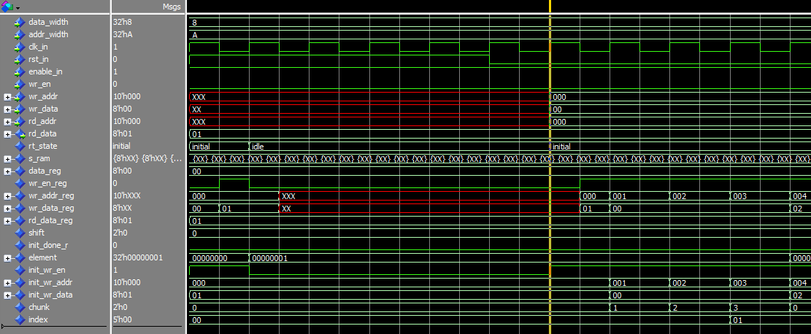

04.12

1. the flash-based FPGA don't support initializing block RAMs as ROMs in the manner of a Xilinx device. similar like ProASIC sm2 don't have SRAM-based configuration that is used to
   set the contents of a block RAM meant to be used as ROM
2. trading resource for time: refers to a design optimization strategy in FPGA where you can used more hardware resources(like LUTs, registers, RAM) to achieve faster processing speed. It is essentially a trade-off relationship.
3. One possible work-around to this is to have a flash or other non-volatile device on your board which holds your ROM initialization data, and after reset some FPGA logic reads the flash and writes those data to BRAM. (BRAM is two-port so this is easily managed.) After intiialization is complete you can bring your processor out of reset.

* router_routing_table_top_file

  * purpose: create fsm, after power on, initialize value to RAM,
  * turn RAM into a component and instantiate it in the top-level of the routing_table design
* for the detail of the FSM:

  1. 3 state: idle refer to the FPGA wait for stable after power up,
  2. initial refer to after reset or power up write the path address to RAM
  3. init_done
     1. initialization done, assign wr_addr_reg from input, same as wr_data_reg
* code detail:

  1. declare variable index range to c_num_port
     1. if index < c_num_ports, 当初始地址等于32时，说明0 to 31的, 也就是path address routing table已经配置完成
     2. 直接将值赋给reg，然后再由reg 将值给ram, wr_data_reg在initial 周期内将计算结果得到，然后赋值给RAM component，然后在initial state期间 assert init_wr_en
        1. 需注意 port mapping: for input port mapping, it can directly map input port to component input, no intermediate signal needed
        2. output port mapping must declare internal signal first, internal signal then connects to output port
        3. 为了地址计算方便， declare init_wr_addr unsigned, then convert to std_logic_vector
     3. shift 用于mod, 因为写地址8 bit, read 32 bit, 需要等待4个周期，才能将下一个index，也就是下一位置1
     4. set 4个chunk, 也就是在第4个chunk时，可以切换下一个index
     5. 具体的RAM读写数据在routing_table_ram中执行，因此top 中并不需要相应的逻辑
  2. 目的只是创建一个组合逻辑计算出相应的值，将这个值赋给RAM就行，不需要额外创建一个小RAM来给它赋值了, 因为每次只能给ram写一个数据，因此用 for loop 并不合适，因为这会生成一个并行的结构
  3. 注意for loop, even in sequential logic, the behavior of for loops depends on how they're written and synthesis tool optimization, if without state machine control, the loop will be unrolled into combinational logic, completing in one clock cycle. Only the final loop result will be registered.
     4

routing_table_top code debug

1. signal dont initialized, resulting in init_wr_addr being x, including reset
2. wr_data_reg assign to RAM, but first address has some error, it should be 00 00 00 01, 问题是时序逻辑中使用了两个地址register，所以每一次register 赋值都需要一个时钟周期
3. 在FSM内使用variable 而不是signal，然后在 用组合逻辑给data, address赋值，when in init_done state, since wr_addr_reg and wr_data_reg updates are inside sequential logic, it causes a one clock cycle delay
4. use combinational multiplexer, decide whether to use the input port or the initial signal based on the state of FSM
5.

05.12

1. for variable:
   1. if variable is in combinational logic, usually synthesized into pure combinational circuits, don't consume storage resources.
   2. if in sequential logic, it will be synthesized into FF if the value need to be maintained between clock cycles
      1. often optimized to keep only the final result,
   3. in loops: static loops (fixed iteration count) are usually unrolled into combinational logic,
      1. dynamic loops might be synthesized into state machines

06.12

for mixed_width_ram structure, 和routing table一样也需要重新将ram初始化，因为routing table只是一个shadow_routing table, 因此使用和一样的FSM 对ram 进行赋初值，

1. 在rt_arbiter中，两个RAM结构的enable使用的是同一个信号，axi_wr_en,因为要确保两个的RAM数据一致
2. 注意在mixed_width_ram中没有generic，可以使用function计算长度 或者再定义一个generic，使用package或者generate语句
   1. in VHDL the order of declarations in VHDL is important and follows a specific hierarchy
   2. 在综合时出现无法编译，因为使用了变量作为vector的下标量，注意width, the bit range used to select parts of a vector must be determined at compile time, it cannnot depend on variables or signals that change during runtime
3. 不需要rd_addr_reg, 因为模块采用直接映射，直接从input 到component
4. 相应的在rt_arbiter模块对于mixed_width_ram_top 模块的rst_in 也应该添加上

07.12

1. Router 4 physic port loop without priority 上传到了GIT project (priotrity fifo)
2. 但是router IP core变为 none priority时port4 无法连接，相应连接出现 charracter Sequence Error
   1. 读取routing table都没有问题
   2. spacewire router其中一个port 在综合后出现无法与Brick MK4 连接的情况，错误原因时charracter Sequence Error，然后我添加了一些spw node4的信号进入内置logic analyse进行综合，又可以进行连接了，我检查了综合工具 spw node4 attribute syn\_noprune=1 ,因此应该不是综合工具prune 了spw 模块的register造成的。此外如果设置为priority 为fifo 没有出现port不能连接的情况spacewire router其中一个port 在综合后出现无法与Brick MK4 连接的情况，错误原因时charracter Sequence Error，然后我添加了一些spw node4的信号进行综合，又可以进行连接了，我检查了综合工具 spw node4 attribute syn\_noprune=1 ,因此应该不是综合工具prune 了spw 模块的register造成的。此外如果设置为priority 为fifo 没有出现port不能连接的情况我将port4 添加了
