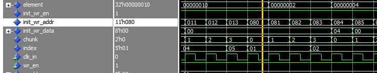
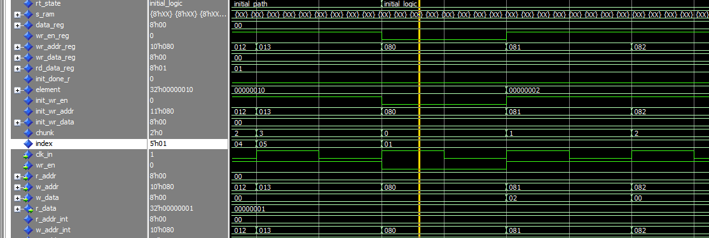

# 09.12

### ### *  编写routing_table version 2, 考虑初始化前几个logicAddress

* router_routing_table_top_v2

~~~~

code detail:

1. 源代码基础上将initial state扩展成 initial_path and initial_logic state, (based on the source code, expand the initial state into ...)
2. because the logic address is from 32 to 255 and is 32bits and is represented in the routing table as 8 bits, the hexadecimal range multiplied by 4 is from 0x80 to 0x400.
3. in initial_logic state, the condition index< c_num_ports is unnecessary because all remaining logic addresses need to be initialized
4. 修改后代码问题在于从initial_path to initial_logic 之间 第一个地址 就是0x80  element,也就是init_wr_data 晚了一个周期才取到正确的值，也就是只取到element(01) (15 downto 8)的值
5. 
6. 在leave initial_path state时 init_wr_en:=0，避免写入多余数据
7. 
8. the key lies in the timing of the state machine and when variables/signals get updated. the key points are the value of element is not update, 也就是在else中的其实是有一个周期了， the new value of index(1) won't be avaliable until the next clock cycle. if we want to update element immediately, you should update it during the state transition
9. 不知道为何新创立的routing_table_v2 initialization value都对，但是产生RMAP Reply command有问题，因此建立routing_table_v3，只使用function对RAM进行赋值
10. type t_byte_ram is array (natural range <> ) of std_logic_vector(7 downto 0); 源代码routing_table中 这是一个自定义的类型， nature range<> 表示这是一个 unconstrained array, 具体大小在实例化时才确

### ~~~~10.12

1. 在原routing_table中之所以 如果直接用初始function对ram 赋值会使用过多的FPGA resource 是因为init_router_mem return v_ram, v_ram 是t_ram 类型，t_ram 又是 type t_ram is array (natural range <>) of mem_element。 the function returns the entire memory array at once
2. 还是使用FSM去初始化
~~~~

* how to handle register data during state transitions
  * in FSM, we need to consider the timing of register updates. Since register values only update on the clock edge, we need to prepare data for the next state while still in the current state
  * recommended design:

    * dual process design pattern:
    * sequential process: handles state register and data register updates
    * combinational process: handles next state logic and data preparation
    * use intermediate signal: like next_state and next_data, avoid modifying register values directly in combinational logic
    * calculate data values needed for next state while in current state
    * 在case语句前给所有信号提供默认值

      * Provide default values for all signals before case statement
      * prevent unwanted latches
      * 如果没有就会create a latch to maintain this value. this is not we want. Ensures signals have defined value in all cases
* why avoiding latch circuits is so crucial in FPGA design. Filp-flops are like elevator with precise schedules- they only move at specific times(clock edges), while latches are like elevators that might move at any time
  * in synchronous design, we need to accurately predict how long signals take to propagate from one flip-flop to another. But latches are level-sensitive and can change state at any time.
    * so latch will makes timing analysis extremly complex, meeting timing requirements difficult
    * latch are harder to predict, especially under varying conditions: temperature changes may affect behavior
  * so how to avoid:
    * ensure complete assignments in combinational logic
    * use default values to prevent latch inference
