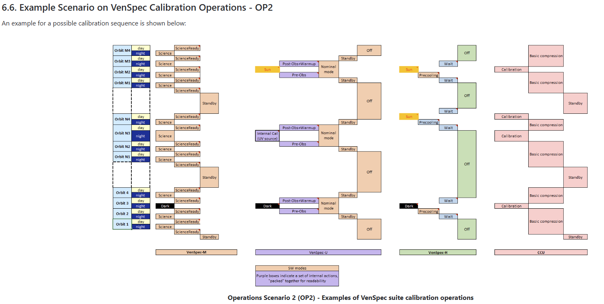
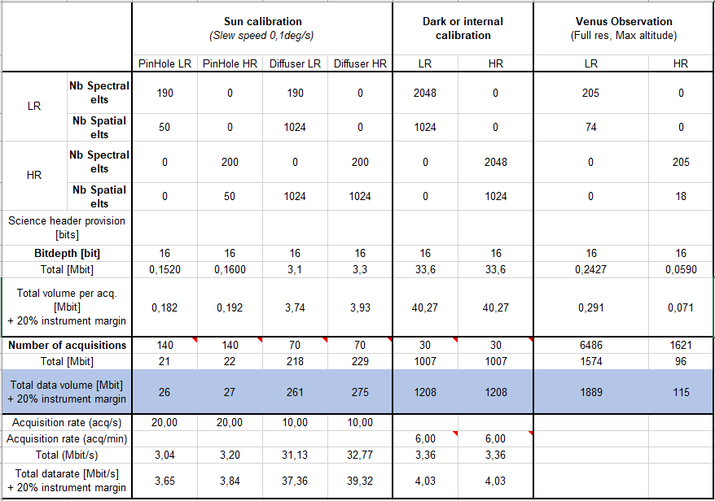
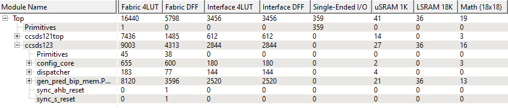
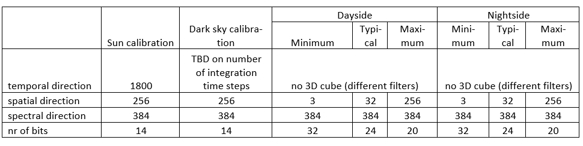

# Data Handling Budget

The actual data transmission from VenSpec CCU to S/C will always be performed with bursts at the max allowed SpW data rate between CCU and S/C

The VenSpec team strongly recommends to work with the specified data volumes, rather than with data rates.

# VenSpec-U requirements to CCU

https://venspec.atlassian.net/wiki/x/BQDgAw

### R0-CCU-0012          Data production Venus observation mode

In Venus observation mode, VenSpec-U will generate Science data for LR and HR channels for a duration of 2820s typically.

Worst case, including 20% margin:

- LR science data: Bursts of 293 kbit every 200 ms (~1.5 Mbit/s)
- HR science data: Bursts of 73 kbit every 1500 ms

As a goal, the CCU shall be able of handling and compressing science data arriving at the CCU at a maximum rate of 6 Mbit/s

Note

* An acquisition always comes with a dedicated science header.

### R0-CCU-0013     Data production sun calibration mode, pinholes

Worst case (incl. 20% margin): the 140 acq. will be sent in 7s minimum:

- Science data (both channels on a single acq.): Bursts of 380 kbit every 50ms

This results in a maximum data rate of 7,6 Mbps

### R0-CCU-0013     Data production, Sun calibration mode, Diffusers

This results in a maximum data rate of 77 Mbps

During Sun calibration mode with Diffusers, VenSpec-U will generate up to 70 acquisitions.

Worst case (incl. 20% margin): the 70 acq. will be sent in 7s minimum:

- Science data (both channels on a single acq.): Bursts of 7670 kbit every 100ms

👀️ need to tack care whether over the DHU max

### R0-CCU-0025   Buffer memory

The CCU shall contain enough memory to buffer the VenSpec-U channel's data as long as needed before dump to S/C becomes possible. The sizing case corresponds to a single solar scan with diffuser (537 Mbit incl. 20% margin).

### R0-CCU-0040 Compression cores parameters in V-U TC

The CCU shall pick up the compression cores parameters from the V-U configuration TC, configure the compression cores, then dispatch the TC to V-U.

This is to ensure that the compression cores are configured before V-U sends science data.

# VenSpec calibration operation

# Venspec-u intro

VenSpec-U is an imaging spectrometer operating in the ultraviolet, designed to observe the atmosphere of Venus.

It employs of a pushbroom observation method

## Venspec-u data

for dark calibration

Nx: 1024

Ny: 30

Nz: 2048

对于Venspec-U dark calibration 这里所提供的parameter，compression core 只能被配置BIP-MEM mode FPGA 才有足够的resource 综合两个SHyLoC compressor, 这时根据计算 单个compression core 用于储存intermediate data 大小为67 Mbit.

## VenSpec-U Dark Calibration and Memory Requirements

For the VenSpec-U dark calibration data, the compression core would need to be configured in BIP-MEM mode since the FPGA wouldn't have sufficient internal resources to handle this data volume. Based on the calculations, a single compression core would need approximately 67 Mbit of memory for storing intermediate data during compression.

对于Venspec-H, 我也注意到了只有calibration data才能 使用3D compressor, 在observation 的时候只能使用1D compression, 对于SHyLoC 由于input data 是由ccsds123进行预处理，但是 CCSDS123 the bitwidth can only be from 2 to 16. 但是Venspec-H 的位宽需要32bits, 这超过了CCSDS123 的处理范围。 所以我认为对于对于Venspec-H 更合理的是所有数据都使用CCSDS121 进行1D压缩，否则如果使用CCSDS123 3D处理Venspec-H，就需要额外需要一个单独的CCSDS121 处理normal data

这里需要注意的是compression core 的结构是在compile time 决定的，并不能在run-time的时候修改，所有SHyLoC 需要在综合前决定使用CCSDS123 或者CCSDS121 处理

## VenSpec-H Compression Considerations

For VenSpec-H, I've identified an important limitation. The documentation indicates that only calibration data could potentially use the 3D compressor (CCSDS 123), while observation data would need to use 1D compression (CCSDS 121).

The key constraint here is bit width. The CCSDS 123 implementation in SHyLoC can only process data with bit depths from 2 to 16 bits, as specified in the D\_GEN parameter. However, VenSpec-H requires up to 32 bits of precision for certain observation modes.

This exceeds the processing capability of CCSDS 123 as implemented in SHyLoC. Therefore, a more reasonable approach would be to use CCSDS 121 for 1D compression of all VenSpec-H data. Using CCSDS 123 for 3D processing of VenSpec-H would require an additional standalone CCSDS 121 processor for normal observation data, which adds complexity.

## Architecture Configuration Limitations

It's important to note that the compression core architecture (BIP, BIP-MEM, BSQ, or BIL) must be determined at compile time and cannot be modified during runtime. The SHyLoC implementation requires deciding whether to use CCSDS 123 or CCSDS 121 before synthesis.

This means that the system design needs to be finalized before implementation, and the choice between compression algorithms cannot be made dynamically during mission operations.

## compressed data order

我真正担心的是compressed data output 传输给processor可能发生问题，因为compressed data 如果像 流模式直接通过spw 输出给processor, Router controller设计的逻辑是根据compressor dataout 的Asymetric FIFO 空信号决定的，当这个FIFO empty时说明没有待发送的compressed data, 这时router controller将发送EOP 数据。~比如compression core 的尽管Pablo 提议在first pixel of frame 添加 data id 以保证能追踪数据，但比如Venspec-U one line data 将分为两个packet 传输，这时可以预想到肯定会有两个EOP character，但由于 one line data有一个data id, 这肯定会造成第二个packet compressed data 不含data id.~   因为SpW Router 中spw port 发送EOP 会释放端口，下一个port 就可以发送新的数据包

这时按照目前设计的controller逻辑就有可能一个compressed data package 中不含data ID. 比如当CCSDS121 作为block encoder时，encoder 将收集J 个样本（8 to 64), 如果按照目前spacewire controller的 逻辑，每J个样本所压缩的值会自动发送给processor 然后附带一个EOP，按照我的理解比如Venspec-U band number 大于190, 这样肯定导致会有部分packet数据不含 data ID.

所以这会导致来源于不同通道的不含data ID 的数据交替 传输给processor。

所以我认为所有的compressed data 最好是先存储在SDRAM 中，然后通过memory controller 将 compressed data 传输给processor这种方法无疑会更复杂

或者是每个compressor 额外设计一个FIFO，如Venspec-U compressor band number最大为2048， 所以FIFO大小应该至少是8byte header 加上 4Kbyte, 相当于FPGA 传输给processor也是按照每一个line data所压缩的数据传输给processor， 这样才能保证compressed data中肯定是含有data id.

I'm concerned about potential issues with compressed data output transmission to the processor. If compressed data is sent directly to the processor in streaming mode via SpW, the Router controller logic is determined by the empty signal from the Asymmetric FIFO, which is used to split 32bit compressed dataout to 8bit spw data format. When this FIFO is empty, indicating there's no more compressed data to send, the router controller sends an EOP (End of Packet) signal.

Because when the SpW Router sends an EOP from a SpW port, it releases that port, allowing the next port to send a new data packet.

At this point, according to the current controller logic design, it's possible that a compressed data package might not contain a data ID. For example, when CCSDS121 functions as a block encoder, it collects J samples (8 to 64). According to the current SpaceWire controller logic, the compressed values for each J samples would automatically be sent to the processor followed by an EOP. Based on my understanding, for something like VenSpec-U with a band number greater than 190, this would inevitably result in some packet data not containing a data ID.

So, this will cause data without a data ID coming from different channels to be alternately transmitted to the processor.

Therefore, I believe all compressed data should ideally be stored in SDRAM first, and then transferred to the processor via a memory controller, though this approach would undoubtedly be more complex.

Alternatively, we could design an additional FIFO for each compressor. For example, with VenSpec-U's maximum band number of 2048, the FIFO size should be at least an 8-byte header plus 4KB. This would be equivalent to the FPGA transmitting data to the processor based on the compressed data for each line, which would ensure that compressed data definitely contains the data ID.

### fifo controll 

使用fifo的话就需要类似一个 counter , 每一个line 数据都可以计数一次，直到line 计数等于spatial number 以及 fifo 为empty 可以代表compressed data 传输完成

另一种可行方案是data ID 不放入pixel data中，

例如有三个spw port 1，2，3都想传输数据给同一个port 4，这时router怎么判断优先级，比如priority 为fifo 和none有什么区别？当处于fifo priority时，port1 第一个传输数据给port4， 然后是port2， 那么这时只有当port1 的全部数据都传输给port4 了，port2 的数据才可以传输给4 吗？

## Detailed Process

1. While Port 1 is transmitting data to Port 4, it maintains exclusive control over the output port.
2. After Port 1 has transmitted its entire packet, it sends an EOP (normal end) or EEP (error end) marker.
3. The router detects the EOP/EEP, indicating the current packet has been fully transmitted, and then:
   * Releases the connection between Port 1 and Port 4
   * Checks the FIFO queue for the next pending request (Port 2 in this case)
   * Establishes a new connection from Port 2 to Port 4
4. Port 2 can now start sending its packet, until it also sends an EOP/EEP.
