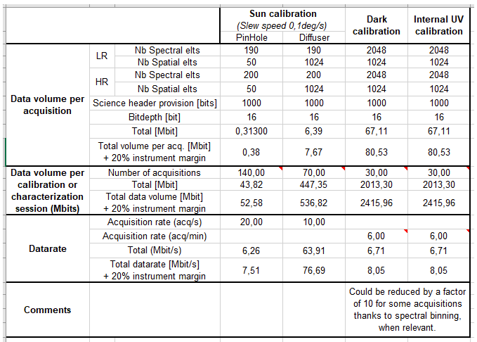

# Data Handling Budget

The actual data transmission from VenSpec CCU to S/C will always be performed with bursts at the max allowed SpW data rate between CCU and S/C

The VenSpec team strongly recommends to work with the specified data volumes, rather than with data rates.

# VenSpec-U requirements to CCU

https://venspec.atlassian.net/wiki/x/BQDgAw

### R0-CCU-0012          Data production Venus observation mode

In Venus observation mode, VenSpec-U will generate Science data for LR and HR channels for a duration of 2820s typically.

Worst case, including 20% margin:

- LR science data: Bursts of 293 kbit every 200 ms (~1.5 Mbit/s)
- HR science data: Bursts of 73 kbit every 1500 ms

As a goal, the CCU shall be able of handling and compressing science data arriving at the CCU at a maximum rate of 6 Mbit/s

Note

* An acquisition always comes with a dedicated science header.

### R0-CCU-0013     Data production sun calibration mode, pinholes

Worst case (incl. 20% margin): the 140 acq. will be sent in 7s minimum:

- Science data (both channels on a single acq.): Bursts of 380 kbit every 50ms

This results in a maximum data rate of 7,6 Mbps

### R0-CCU-0013     Data production, Sun calibration mode, Diffusers

This results in a maximum data rate of 77 Mbps

During Sun calibration mode with Diffusers, VenSpec-U will generate up to 70 acquisitions.

Worst case (incl. 20% margin): the 70 acq. will be sent in 7s minimum:

- Science data (both channels on a single acq.): Bursts of 7670 kbit every 100ms

👀️ need to tack care whether over the DHU max

### R0-CCU-0025   Buffer memory

The CCU shall contain enough memory to buffer the VenSpec-U channel's data as long as needed before dump to S/C becomes possible. The sizing case corresponds to a single solar scan with diffuser (537 Mbit incl. 20% margin).

### R0-CCU-0040 Compression cores parameters in V-U TC

The CCU shall pick up the compression cores parameters from the V-U configuration TC, configure the compression cores, then dispatch the TC to V-U.

This is to ensure that the compression cores are configured before V-U sends science data.

# Venspec-u intro

VenSpec-U is an imaging spectrometer operating in the ultraviolet, designed to observe the atmosphere of Venus.

It employs of a pushbroom observation method

## Venspec-u data

