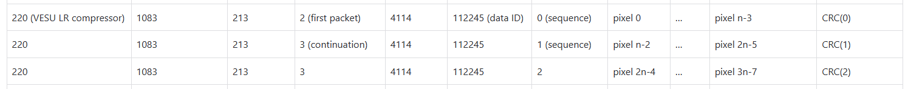

需要明确的是：怎么管理来自不同通道buffered sensor data或者compressed data, 因为compressed data 不再是CCSDS packet了，也就是不同VenS 数据在压缩后怎么区分?比如进入buffer 的memory应该如何再被提取出来传输给 processor, 这涉及到需要processor 的软件部分来提取储存在buffer memory的数据

in CCU-channels SWICH 11.3 评论 by pablo:

1. All packets, regardless of its content and their need to be compressed, have to be formatted as CCSDS packets (primary and secondary header, service type, sub-type, APID, length, etc.). In particular, packets related to the transmission of science (data and metadata) shall contain the values demonstrated below (beside the rest of mandatory fields from the CCSDS standard).

👀️ Q: 所以这意味着待压缩数据包进去compressor前页是CCSDS packets，那么就包含 不仅是scientific data,也会有header data和CRC ，应该压缩核如CCSDS123 按照3D 压缩， 那么压缩尺寸已经固定了，所以我猜测这里是compressor将strip off这些数据，只保留scientific data, 这样在理想状态下compressor直接通过spw link 传输给processor，如果拥塞则需要存在buffer memory中，这时就需要processor 发送命令提取这部分缓存的compressed data。

note: The header of the science packets to be compressed have to have a fixed length because the FPGA will strip that header irrespective of the content. =====已注明

1. VenSpec-U is Pushbroom , since the limit of VenSpec-H, only BIP will be used, 但需要注意的是这与图上标注的不太一样，因为这是VenSpec- U 的采集方式，但不应该是Venspec-U的输出方式
2. 但是还有一个问题，DHU Router 处理能力，比如3 个通道的HK packet，已经VenSpec-M 的scientific data/ 所以Router应该设置为FIFO 模式吗？这样每个端口的处理时间相同，

   1. 使用FIFO仲裁能确保按照请求到达的顺序处理，避免某些端口被长时间阻塞的问题
   2. 我认为processor 应该来负责调度整个VenSpec 数据压缩调度功能，（我需要确认各个VenSpec channel数据大小），比如三个VenSpec数据同时到达DHU，其瞬时速率会超过FPGA to Processor(100 mbps) 上限， 尽管可能拉长时间 平均速率不会超过

      1. 虽然VenSpec-U , M 数据会压缩后才传输给processor，所以FPGA 可以先接收来自VenSpec的数据，但是HK (size 4114 bytes ) 依然是传输给processor （SpW address 192）
      2.
3. 已经压缩的数据如果未直接通过spw 传输到processor中，而是存在buffer中，则会加大DHU调取的复杂度(但问题是怎么保证新数据不会覆盖老数据？是否能计算最坏情况，给图像缓存计算最大的地址空间 ）

   1. Every single sensor readout shall be transmitted using separate SpaceWire packets and shall
      be finished before next readout starts. from CCU SWICH
4. Two data fields at the beginning of the payload (D0 and D1) that contain:

   1. D0: The data set ID (to identify this particular data set)
   2. D1: A sequence number (to track the packet's position in the sequence)
   3. 问题是压缩完成后D0,D1 还需要附在compressed data 前吗？
   4. **The key issue**: The compression core will discard these first two fields (D0 and D1) before compression. This means that the data ID information won't be part of the compressed data.
5. 我在考虑compressor 的runtime configuration功能，我的设想是processor在每次传输后 通过spw 发送configuration data， 但是SHyLoC 通过AHB接收配置信息，

##question about DHU datarte especially for sun calibration mode

@VESP-U R0-CCU-0014

During Sun calibration mode with Diffusers, VenSpec-U will generate up to 70 acquisitions.

Worst case (incl. 20% margin): the 70 acq. will be sent in 7s minimum:

- Science data (both channels on a single acq.): Bursts of 7670 kbit every 100ms

This results in a maximum data rate of 77 Mbps

但是根据 VenSpec Data Budget Summary 显示actually used max data rate 为65 Mbit/s，我不知道这是怎么来的

所以我的

### from Pablo

Compression can be configured for 2D (frames) or 3D (cubes = several frames). In either case, pixels from two different elements shall not be sent in the same packet. For instance, if a frame is 512 bytes (very small) one can compress a cube of 4 frames by sending a packet of 2048 bytes. However, if you choose to compress the frames separately, they shall be in 4 separate packets of 512 bytes each.

question from Pablo mail:

* When compressing in 2D (single frame) when does the compression start? After the first spectrum (i.e. after receiving all the colors corresponding to a spatial location) or after the end of the frame (i.e. when all the colors for all the spatial locations have been received)? How will the GR712 be notified that the compression of the frame is done so that it can be processed further?
* Same questions for 3D compression: can the compression start after the first spectrum or does it have to wait to the first full frame? Does the compression core have to know in advance how many frames are coming or does it run in "streaming mode" where it can take as many frames as you through at it?

A:

1. 这里的compressing in 2D 指的是 只使用CCSDS121 进行压缩吗，
   1. 根据https://venspec.atlassian.net/wiki/x/SY5D （DHU Interface to VenSpec-U）VenSpec-U 在扫描时是2D 方式扫描，但是VenSpec-U 单次采集的数据应该是x 轴是special line

这是CCU-Channels SWICD 的示意图，但这应该只是CCSDS123 压缩方式示意图，并不应该是Venspec-U 的采集方向

Additionally, for the SHyLoC compressor, there is no 2D compression mode. When SHyLoC uses CCSDS 121 as the predictor, it performs 1D compression, and when it uses CCSDS 123 as the predictor, it performs 3D compression.

具体来说，对于CCSDS123 在预测时如示意图所示，如果配置为full prediction 在计算local differences 会使用spectial 方向的4个sample 和 spectral 方向上的p band的值， 即使是reduced prediction 不计算directional local difference(spectial direction) 但在计算Local sum 时也会根据配置参数计算 top of current sample or using 4 neighbouring sample的值。 所以CCSDS123不存在2 D 压缩，当然例外是处理第一行的数据不存在 top of current sample的值，所以只使用left of current sample的值。所以CCSDS123 不存在2d compression的说法

Specifically, for CCSDS123 during prediction as shown in the diagram, if configured for full prediction, it will use 4 samples in the spatial direction and P band values in the spectral direction when calculating local differences. Even with reduced prediction that doesn't calculate directional local differences (spatial direction), when calculating the Local sum, it will still compute values based on configuration parameters using either the top of current sample or using 4 neighboring samples. Therefore, CCSDS123 doesn't have 2D compression. The only exception is when processing the first row of data where there's no 'top of current sample' value, so it only uses the 'left of current sample' value. Therefore, the concept of 2D compression doesn't exist in CCSDS123

如这图所示X-axis 应该表示cross-track spatial dimension,

VenSpec 的采集方式是按照BIL 采集数据，根据2200 DHU Interface to VenSpec-U ， VenSpec 采集的数据应该可以处理后给CCU 输出按照BIP 格式输出，也就是spectral firt. 但是我看见Pablo 在邮件中说 pixel imformation in BIL format, 我不知道这是否代表对DHU 压缩核处理VenSpec-U 的数据格式要求发生了改变？如果改变我们需要将其中两个压缩核调整成压缩BIL 格式。 此外，因为CCSDS123 在进行3D 压缩时 Throughput BIL只有BIP 格式 大约11-18%（根据图像会有些不同），如果我们需要使用BIL 格式压缩VenSpec-U 数据我们需要对这点进行考虑。

### Shyloc

BIP  architecture is able to accept one compressed sample per  clock cycle. This feature makes this prediction architecture  capable of providing the highest possible throughput.

As analternative to the BIP architecture, BIP-MEM ar chitecture offers the user the possibility of using an external  memory to store the mentioned FIFO\_TOP\_RIGHT. The  access to this memory is performed by the AMBA AHB  master interface present in the IP core. One read and one  write operations are needed per sample compression.

When compressing in 2D (single frame) when does the compression start? After the first spectrum (i.e. after receiving all the colors corresponding to a spatial location) or after the end of the frame (i.e. when all the colors for all the spatial locations have been received)? How will the GR712 be notified that the compression of the frame is done so that it can be processed further?

A:

对于BIP 压缩，基本可以理解成当CCSDS123 获得前p个波段的数据就可以进行压缩，对于压缩算法计算局部和 时所需要的邻居像素，只用提取储存在FIFO中的数据就可以了，所以使用BIP压缩，compressor 可以更多的并行处理，基本等于每一个周期可以处理一个样本。

对于BIL 压缩，在计算局部和 和 计算局部差值时都有更多的数据依赖，无论是使用reduced prediction(只使用前P个波段的中心局部差值 `𝑑𝑥,𝑦,𝑧`进行预测) 还是full prediction (使用中心局部差值(central local differences) `𝑑𝑥,𝑦,𝑧`和方向局部差值(directional local differences) `𝑑𝑥,𝑦,𝑧^NW`、`𝑑𝑥,𝑦,𝑧^N`、`𝑑𝑥,𝑦,𝑧^W`进行预测) 计算局部和需要等待 $P \times Nx $ 数据才能开始压缩。

所有总结来说，使用BIP order 压缩时，数据是按spectrum 方向传输，只需收到p个波段（可以设置为3）就可以开始压缩了，而使用BIL ，由于计算 local differeces 原因，而BIL 是X-axis 传输，所以须等待P 波段 数据传输完成才能计算后续prediction residual. 这也就是BIL 压缩 Throughput 比BIP低的原因。 但是ccsds123使用BIL mode 压缩时 也都不需要receive all the spectrum 就可以开始压缩了（只需要P or P+3 个 band）. 在使用BIP-mode 时每一个pixel都含有了所有的spectrum。

How will the GR712 be notified that the compression of the frame is done so that it can be processed further? 对于这个问题：

如果compressor 压缩完了所有数据，Finished signal 会asserted。然后compressor 会根据配置模式进行配置，配置完成了就可以进行下一次压缩。但是目前的设计还没有考虑到通知GR712 压缩完成。目前FPGA内compressor 的设计是：使用compile time configuration, compressor 会持续不断地进行压缩 Hyperspectral image(大小固定为$ Nx \times Ny \times Nz$ ) 每一次的压缩不需要GR712的干预。

在这里compressor提供两种配置方式，一种是在compile time 配置，这意味着所有所有参数都在FPGA synthesis前被配置，所以配置成这个模式时压缩器会自动根据参数进行配置并开始准备接收sample 开始新的压缩过程

另一种是run-time 配置，这是compressor需要通过AHB bus 接收配置参数，只有接收参数成功并且配置参数在定义的范围内 compressor才能配置成功，compressor 配置成功后，就可以开始压缩。

所以在这里我也需要确认compressor是选用 run-time configuration 还是compile-time configuration. 如果压缩参数是预定义好的不需要进行调整的话使用compile-time configuration 因为选用run-time configuration ，我们需要使用一个ahb master 配置 SHyLoC compressor, 我们需要明确compressor 配置方式和要求, 比如可以在FPGA 设计一个ahbram ，configuration parameter 可以储存在这个ahbram中，prarameter可以通过GR712 修改 configuration parameter 或者根据venspec channal 的packet 配置 compressor.

Therefore, I also need to confirm here whether the compressor uses run-time configuration or compile-time configuration. If the compression parameters are predefined and don't need adjustment, compile-time configuration would be appropriate. Because if using run-time configuration, we need to use an AHB master to configure the SHyLoC compressor, and we need to clarify the compressor configuration method and requirements. For example, we could design an AHBRAM in the FPGA where configuration parameters could be stored, and parameters could be modified through the GR712 processor or configured based on packets from VenSpec channels.

对于CCSDS123 不同的数据排列类型，compressor处理方式也是不同的：

* 在BIP模式下：处理完第一个像素的前P个波段后，压缩就可以开始
  * 一般P 定义为3，因为超过3对压缩几乎没有影响（但p值过大会消耗过多的DSP）
* 在BIL模式下：处理完第一行中足够的像素后，压缩就可以开始

Same questions for 3D compression: can the compression start after the first spectrum or does it have to wait to the first full frame? Does the compression core have to know in advance how many frames are coming or does it run in "streaming mode" where it can take as many frames as you through at it? 关于这个问题我认为ccsds 是当压缩完一个cube后会根据配置的方式，如果不调整parameter，每次compressor完成一个cube（x ,y,z） 压缩后会进行配置，配置完成后会发送ready 信号就会接收Raw image, compressor会计算接收了多少个数据（$ Nx \times Ny \times Nz$）, 如果有data 没有传输给compressor 而compressor没有完成此次压缩的话 compressor会处于等待状态，除非收到全部的input data，

另外对于SHyLoC compressor 并不存在2D compression, SHyLoC 使用CCSDS121作为predictor时 是1D 压缩，使用CCSDS123 作为predictor时 是3D 压缩。

CCSDS121 1d 压缩的机制是什么？以及CCSDS121 作为CCSDS123 的block encoder的好处是什么？为什么不使用CCSDS123 的sample encoder

## CCSDS 121 1D compression mechanism:

CCSDS 121 is a lossless data compression standard that uses a simple unit-delay predictor followed by an adaptive entropy encoder. The compression mechanism works as follows:

1. **Prediction**: The unit-delay predictor estimates the current sample based on the previous sample. For the first sample in a sequence, a reference value is used.
2. **Mapped Prediction Residual**: The difference between the predicted value and the actual value (prediction residual) is mapped to a non-negative integer.
3. **Block-Adaptive Entropy Encoding**: The mapped residuals are divided into blocks of J samples. For each block, multiple encoding options are evaluated concurrently:
   * Fundamental Sequence (FS) coding
   * Sample splitting (with different k values)
   * Second-extension option
   * Zero-block option
   * No compression option
4. The option that produces the shortest codeword for the current block is selected, and an identifier for this option is attached to the compressed block.

## Benefits of using CCSDS 121 as a block encoder for CCSDS 123:

1. **Adaptive Encoding**: The block-adaptive approach allows the encoder to adapt to changing statistics in the data, potentially achieving better compression than the sample-adaptive encoder in some cases.
2. **Lower Bit Rate Capability**: The CCSDS 121 block-adaptive encoder can achieve bit rates lower than 1 bit per pixel (bpp), while the CCSDS 123 sample-adaptive encoder has a theoretical minimum limit of 1 bpp.
3. **Zero-Block Handling**: The block-adaptive encoder has a specific option for blocks of all zeros, which can significantly improve compression for sparse data with many zero values.
4. **Flexibility**: The block-adaptive encoder provides multiple coding options that can be selected based on the data characteristics, potentially leading to better compression performance across a wider range of data types.

The main reason why someone might choose the block-adaptive encoder over the sample-adaptive encoder is the potential for higher compression ratios, especially for data with varying statistical properties or with many blocks of zeros. However, this comes at the cost of increased computational complexity since multiple encoding options need to be evaluated for each block.

The sample-adaptive encoder provided in CCSDS 123 is simpler and may have lower computational requirements, but it cannot achieve bit rates below 1 bpp, which can be a limitation for high compression requirements.

关于CCU-Channels SWICD 11.3. compression implementation ,"Although the data ID will be tracked by correlating the APID of the header with the compression core that is processing it, since D0 and D1 will be discarded by the compression, it might be advisable to put the data ID somewhere among the pixels so that it gets compressed together. The two best candidates are the first pixel of each frame or the first pixel of each line. One solution that will certainly not work is to put it at the beginning of each packet, because then these fake pixels will be scattered all over the frame."  我想知道如果加入这个D0和D1 进 actual pixel, 那么一个cube data set 将这会改变fixed predefined data format 吗？ 我需要明确这一点。

另外在对于

如果不将D0，D1放入对于Data Set ID and Packet Sequence number这些数据是否是在进入FPGA时被去掉？如果是的话，我需要明确这些header 是多少bit--应该不用SWICD 有说明。

Regarding CCU-Channels SWICD 11.3 compression implementation, "Although the data ID will be tracked by correlating the APID of the header with the compression core that is processing it, since D0 and D1 will be discarded by the compression, it might be advisable to put the data ID somewhere among the pixels so that it gets compressed together. The two best candidates are the first pixel of each frame or the first pixel of each line. One solution that will certainly not work is to put it at the beginning of each packet, because then these fake pixels will be scattered all over the frame." I want to know if adding this D0 and D1 into actual pixels will change the fixed predefined data format of a cube data set? I need to clarify this point. Additionally, for APID, Service Type and Subtype, are these data removed when entering the FPGA? If so, I need to know how many bits these headers are. Then I can modify the design to remove these headers before the packet enters the compressor.

另外在service(213,2) and (213,3) 时，关于SWICD 说明的“It shall be noted that APID, Service Type and Subtype, Data Set ID and Packet Sequence number(as well as the 16 bit of the CRC at the end) will be ignored by the compression core, but they will be carefully observed by the processor whenever data is to be sent uncompressed (by sending it to SpW 192 instead of 220).” 这是否说明compression core可以直接忽略这些信息（==APID, Service Type and Subtype, Data Set ID and Packet Sequence number==）不需要在FPGA内去掉这些信息即可，对吗？

Q2:

另一点是关于压缩数据时发生有数据丢包的情况，从而导致Compressor 没有收到足够数量的数据（$ Nx \times Ny \times Nz$）那这时如果下一个Hyperspectrum压缩数据 进入接着压缩会造成数据混乱。所以我想知道有没有必要在DHU FPGA设计这样一个逻辑：当收到一个packet 的service 为（213，1）时表示这个packet是header data，就代表下一次的image 压缩开始了，这时设计一个逻辑给Compressor 输出一个Forcestop signal,使得compressor 强制进入新的压缩状态，避免了当一个新的image 需要压缩，而上一次压缩由于丢包造成未完成压缩的情况。所以相当于每次compressor在接收 header data时都将执行一次forcestop 命令。

Another point concerns the situation when packet loss occurs during data compression, resulting in the Compressor not receiving sufficient data (\$ Nx \\times Ny \\times Nz\$). If the next hyperspectrum dataset then enters for compression, this could cause data corruption. Therefore, I'm wondering if it's necessary to design logic in the DHU FPGA like this: when a packet with service type (213, 1) is received, indicating this packet is header data and representing the start of the next image compression, the design would generate a ForceStop signal to the Compressor, forcing it to enter a new compression state. This would prevent situations where a new image needs compression while the previous compression remains incomplete due to packet loss. Essentially, the compressor would execute a ForceStop command every time it receives header data.

**BIP (Band Interleaved by Pixel)**:

* Processes all spectral bands for one pixel before moving to the next pixel
* Allows for maximum throughput (one sample per clock cycle) as there are fewer data dependencies between consecutive pixels
* Enables pipeline implementation for hardware acceleration
* Memory requirements include storing adjacent samples for all bands

**BIL (Band Interleaved by Line)**:

* Processes a complete line in one spectral band before moving to the next band
* Creates more data dependencies that limit parallelism
* Needs more complex scheduling to maintain throughput
* Requires storing local differences for a line of pixels
* Common for pushbroom sensors in satellite applications

Different architectures have been developed for each ordering to optimize performance. BIP generally achieves the highest throughput but may require more memory resources, while BIL typically aligns better with how data is acquired by many satellite sensors.
