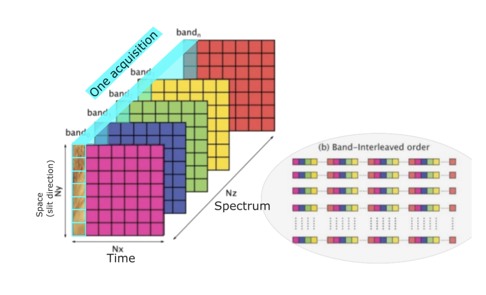
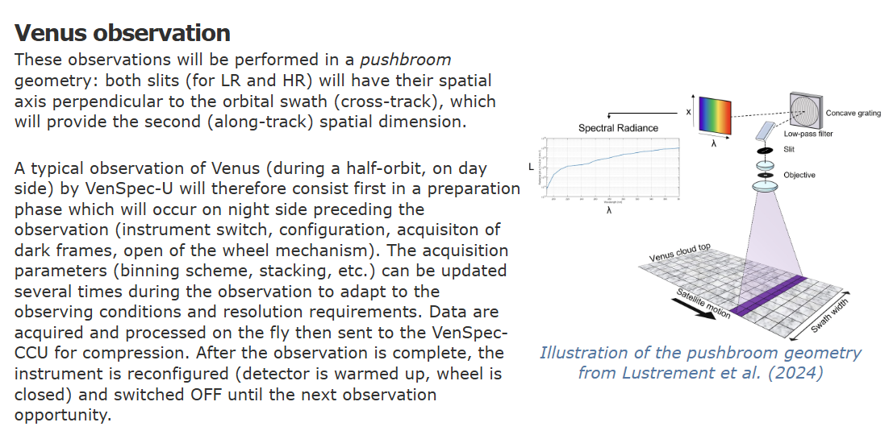

需要明确的是：怎么管理来自不同通道buffered sensor data或者compressed data, 因为compressed data 不再是CCSDS packet了，也就是不同VenS 数据在压缩后怎么区分?比如进入buffer 的memory应该如何再被提取出来传输给 processor, 这涉及到需要processor 的软件部分来提取储存在buffer memory的数据

in CCU-channels SWICH 11.3 评论 by pablo:

1. All packets, regardless of its content and their need to be compressed, have to be formatted as CCSDS packets (primary and secondary header, service type, sub-type, APID, length, etc.). In particular, packets related to the transmission of science (data and metadata) shall contain the values demonstrated below (beside the rest of mandatory fields from the CCSDS standard).

👀️ Q: 所以这意味着待压缩数据包进去compressor前页是CCSDS packets，那么就包含 不仅是scientific data,也会有header data和CRC ，应该压缩核如CCSDS123 按照3D 压缩， 那么压缩尺寸已经固定了，所以我猜测这里是compressor将strip off这些数据，只保留scientific data, 这样在理想状态下compressor直接通过spw link 传输给processor，如果拥塞则需要存在buffer memory中，这时就需要processor 发送命令提取这部分缓存的compressed data。

note: The header of the science packets to be compressed have to have a fixed length because the FPGA will strip that header irrespective of the content. =====已注明

1. VenSpec-U is Pushbroom , since the limit of VenSpec-H, only BIP will be used, 但需要注意的是这与图上标注的不太一样，因为这是VenSpec- U 的采集方式，但不应该是Venspec-U的输出方式
2. 但是还有一个问题，DHU Router 处理能力，比如3 个通道的HK packet，已经VenSpec-M 的scientific data/ 所以Router应该设置为FIFO 模式吗？这样每个端口的处理时间相同，

   1. 使用FIFO仲裁能确保按照请求到达的顺序处理，避免某些端口被长时间阻塞的问题
   2. 我认为processor 应该来负责调度整个VenSpec 数据压缩调度功能，（我需要确认各个VenSpec channel数据大小），比如三个VenSpec数据同时到达DHU，其瞬时速率会超过FPGA to Processor(100 mbps) 上限， 尽管可能拉长时间 平均速率不会超过

      1. 虽然VenSpec-U , M 数据会压缩后才传输给processor，所以FPGA 可以先接收来自VenSpec的数据，但是HK (size 4114 bytes ) 依然是传输给processor （SpW address 192）
      2.
3. 已经压缩的数据如果未直接通过spw 传输到processor中，而是存在buffer中，则会加大DHU调取的复杂度(但问题是怎么保证新数据不会覆盖老数据？是否能计算最坏情况，给图像缓存计算最大的地址空间 ）

   1. Every single sensor readout shall be transmitted using separate SpaceWire packets and shall
      be finished before next readout starts. from CCU SWICH
4. Two data fields at the beginning of the payload (D0 and D1) that contain:

   1. D0: The data set ID (to identify this particular data set)
   2. D1: A sequence number (to track the packet's position in the sequence)
   3. 问题是压缩完成后D0,D1 还需要附在compressed data 前吗？
   4. **The key issue**: The compression core will discard these first two fields (D0 and D1) before compression. This means that the data ID information won't be part of the compressed data.
5. 我在考虑compressor 的runtime configuration功能，我的设想是processor在每次传输后 通过spw 发送configuration data， 但是SHyLoC 通过AHB接收配置信息，

### from Pablo

Compression can be configured for 2D (frames) or 3D (cubes = several frames). In either case, pixels from two different elements shall not be sent in the same packet. For instance, if a frame is 512 bytes (very small) one can compress a cube of 4 frames by sending a packet of 2048 bytes. However, if you choose to compress the frames separately, they shall be in 4 separate packets of 512 bytes each.

question from Pablo mail:

* When compressing in 2D (single frame) when does the compression start? After the first spectrum (i.e. after receiving all the colors corresponding to a spatial location) or after the end of the frame (i.e. when all the colors for all the spatial locations have been received)? How will the GR712 be notified that the compression of the frame is done so that it can be processed further?
* Same questions for 3D compression: can the compression start after the first spectrum or does it have to wait to the first full frame? Does the compression core have to know in advance how many frames are coming or does it run in "streaming mode" where it can take as many frames as you through at it?

A:

1. 这里的compressing in 2D 指的是 只使用CCSDS121 进行压缩吗，
   1. 根据https://venspec.atlassian.net/wiki/x/SY5D （DHU Interface to VenSpec-U）VenSpec-U 在扫描时是2D 方式扫描，但是VenSpec-U 单次采集的数据应该是x 轴是special line

这是CCU-Channels SWICD 的示意图，但这应该只是CCSDS123 压缩方式示意图，并不应该是Venspec-U 的采集方向

如这图所示X-axis 应该表示cross-track spatial dimension,

VenSpec 的采集方式是按照BIL 采集数据，根据2200 DHU Interface to VenSpec-U ， VenSpec 采集的数据应该可以处理后给CCU 输出按照BIP 格式输出，也就是spectral firt. 但是我看见Pablo 在邮件中说 pixel imformation in BIL format, 我不知道这是否代表对DHU 压缩核处理VenSpec-U 的数据格式要求发生了改变？如果改变我们需要将其中两个压缩核调整成压缩BIL 格式。 此外，因为CCSDS123 在进行3D 压缩时 Throughput BIL只有BIP 格式 大约11-18%（根据图像会有些不同），如果我们需要使用BIL 格式压缩VenSpec-U 数据我们需要对这点进行考虑。

### Shyloc

BIP  architecture is able to accept one compressed sample per  clock cycle. This feature makes this prediction architecture  capable of providing the highest possible throughput.

As analternative to the BIP architecture, BIP-MEM ar chitecture offers the user the possibility of using an external  memory to store the mentioned FIFO\_TOP\_RIGHT. The  access to this memory is performed by the AMBA AHB  master interface present in the IP core. One read and one  write operations are needed per sample compression.

When compressing in 2D (single frame) when does the compression start? After the first spectrum (i.e. after receiving all the colors corresponding to a spatial location) or after the end of the frame (i.e. when all the colors for all the spatial locations have been received)? How will the GR712 be notified that the compression of the frame is done so that it can be processed further?

对于CCSDS123 不同的数据排列类型，compressor处理方式也是不同的：

* 在BIP模式下：处理完第一个像素的前P个波段后，压缩就可以开始
  * 一般P 定义为3，因为超过3对压缩几乎没有影响（但p值过大会消耗过多的DSP）
* 在BIL模式下：处理完第一行中足够的像素后，压缩就可以开始

Same questions for 3D compression: can the compression start after the first spectrum or does it have to wait to the first full frame? Does the compression core have to know in advance how many frames are coming or does it run in "streaming mode" where it can take as many frames as you through at it? 关于这个问题我认为ccsds 是当压缩完一个cube后会根据配置的方式，如果不调整parameter，每次compressor完成一个cube（x ,y,z） 压缩后会进行配置，配置完成后会发送ready 信号就会接收Raw image, compressor会计算接收了多少个数据（x乘y乘z）, 如果有data 没有传输给compressor 而compressor没有完成此次压缩的话 compressor会处于等待状态，除非收到全部的input data，

**BIP (Band Interleaved by Pixel)**:

* Processes all spectral bands for one pixel before moving to the next pixel
* Allows for maximum throughput (one sample per clock cycle) as there are fewer data dependencies between consecutive pixels
* Enables pipeline implementation for hardware acceleration
* Memory requirements include storing adjacent samples for all bands

**BIL (Band Interleaved by Line)**:

* Processes a complete line in one spectral band before moving to the next band
* Creates more data dependencies that limit parallelism
* Needs more complex scheduling to maintain throughput
* Requires storing local differences for a line of pixels
* Common for pushbroom sensors in satellite applications

Different architectures have been developed for each ordering to optimize performance. BIP generally achieves the highest throughput but may require more memory resources, while BIL typically aligns better with how data is acquired by many satellite sensors.
