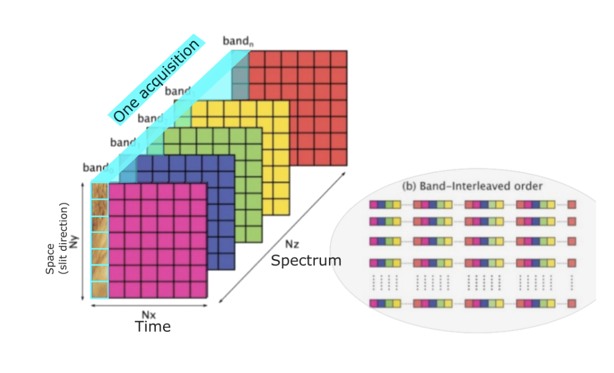
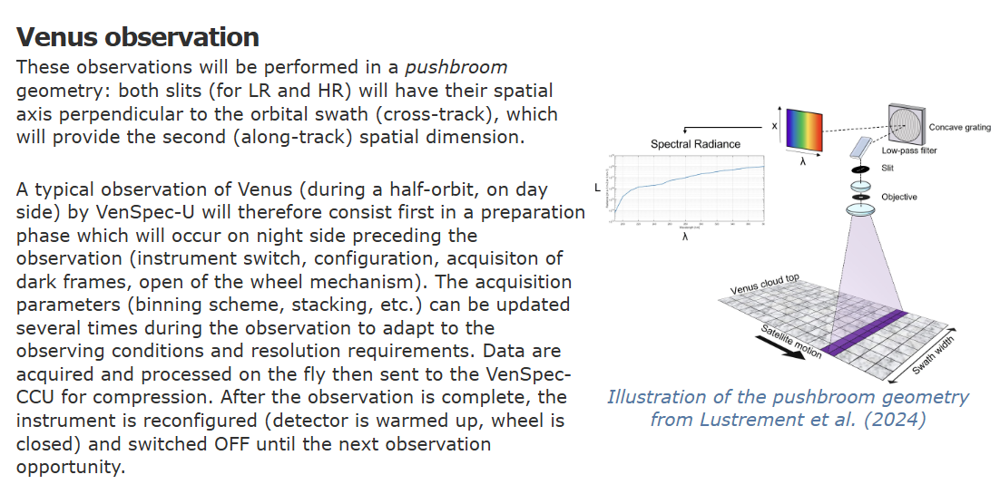
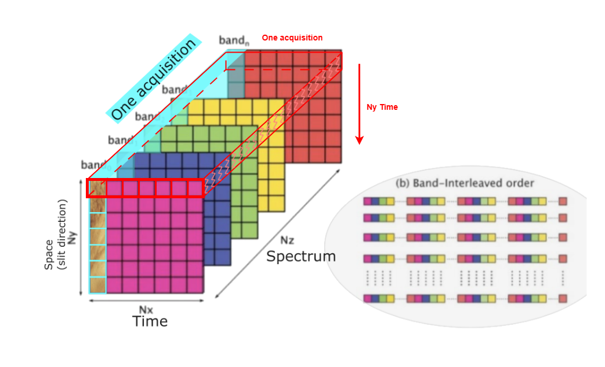
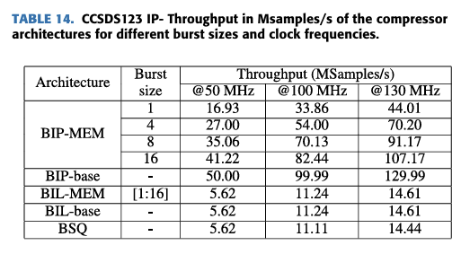
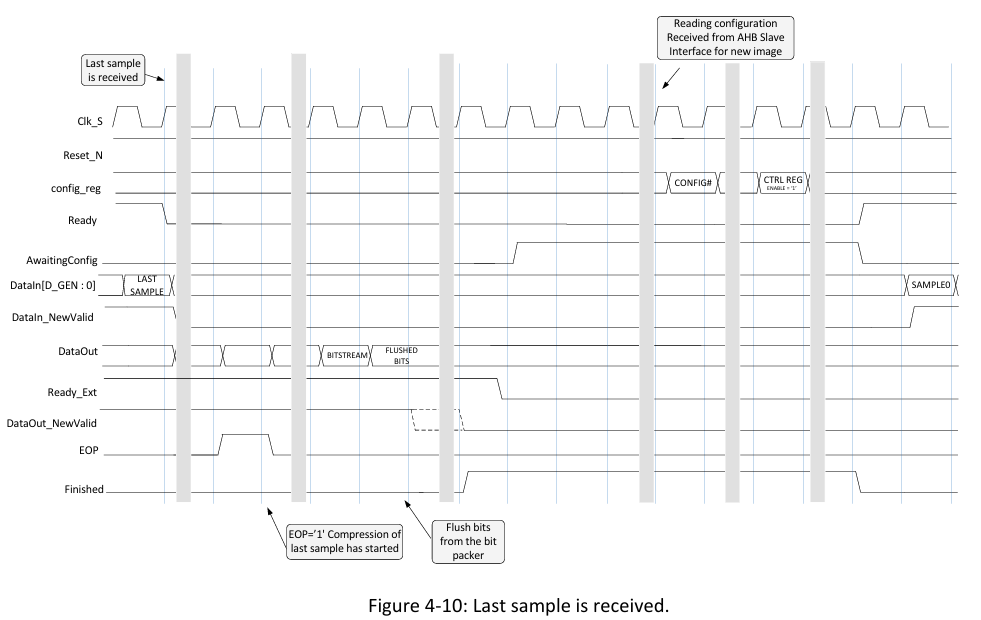
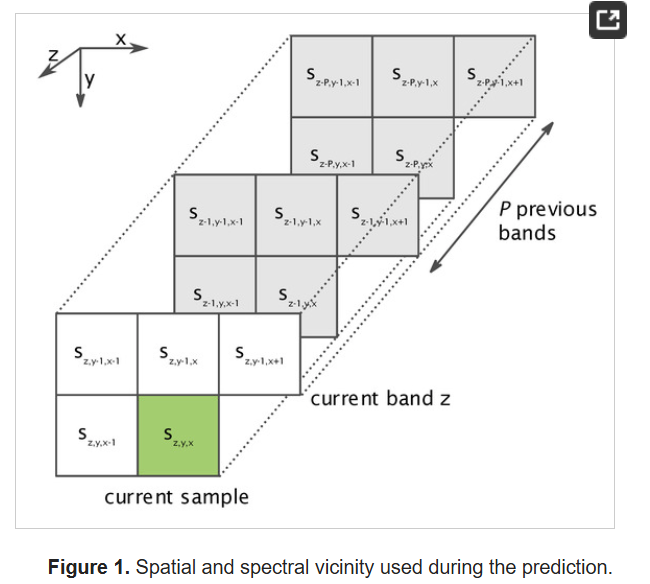

# Issue 1 spectrometer's acquisition direction

This is the image acquisition schematic from the CCU-Channels SWICD, but it should only be an illustration of the CCSDS123 compression method and not represent the data acquisition direction of the Venspec-U. As shown in the Venspec-U schematic, the spatial axis should be the x-axis, not the y-axis, with the y-axis being along-track. So the image acquisition schematic in the CCU-Channels SWICD is drawn incorrectly.

So the actual acquisition method of Venspec-U should be as illustrated in the figure.

# Question for data set of Venspec-U

According to the document (DHU Interface to VenSpec-U) at https://venspec.atlassian.net/wiki/x/SY5D, it is stated that :

- VenSpec-U will acquire a spectra, store it in internal memory, do some processing before sending it to the CCU.
- We can decide "how to send the spectra" to the CCU, and which axis (spectral or spatial) first

VenSpec acquires data in a BIL format. According to the 2200 DHU Interface to VenSpec-U, the data acquired by VenSpec should be processed and then output to the CCU in a BIP format, which means the spectral axis comes first. However, I noticed that Pablo mentioned in an email "pixel information in BIL format." I am not sure if this indicates that the data format requirements for the DHU compression core handling VenSpec-U data have changed. If so, we would need to adjust two of the compression cores to compress data in the BIL format.

Additionally, since CCSDS123 achieves only about 11% throughput in BIL format compared to BIP format during 3D compression (this may vary slightly depending on the image), if we need to compress VenSpec-U data in BIL format, we must take this into consideration.

This is the data from the paper "SHyLoC 2.0: Versatile Hardware Solution for On-Board Data and Hyperspectral," and the result was obtained solely by using CCSDS123.

# Answer for Quetion 1

Q from Pablo : When compressing in 2D (single frame) when does the compression start? After the first spectrum (i.e. after receiving all the colors corresponding to a spatial location) or after the end of the frame (i.e. when all the colors for all the spatial locations have been received)? How will the GR712 be notified that the compression of the frame is done so that it can be processed further?

## Regarding when compression starts:

For BIP compression, it can essentially be understood that CCSDS123 can begin compression once it has received data from the first P spectral bands. For calculating the local sum, which requires neighboring pixels, it only needs to extract data stored in FIFOs. Therefore, when using BIP compression, the compressor can process more in parallel, essentially processing one sample per clock cycle.

For BIL compression, there are more data dependencies when calculating both local sums and local differences. Whether using reduced prediction (which only uses central local differences `𝑑𝑥,𝑦,𝑧` from P previous bands) or full prediction (which uses central local differences `𝑑𝑥,𝑦,𝑧` and directional local differences `𝑑𝑥,𝑦,𝑧^NW`, `𝑑𝑥,𝑦,𝑧^N`, `𝑑𝑥,𝑦,𝑧^W`), the calculation of local sums needs to wait for `P × Nx` data before compression can begin.

In summary, when using BIP order compression, data is transmitted along the spectral direction, and compression can begin after receiving just P bands (which can be set to 3). With BIL, due to requirements for calculating local differences and because BIL transmits along the X-axis, it must wait for data from P bands to be fully transmitted before calculating subsequent prediction residuals. This is why BIL compression has lower throughput than BIP. However, CCSDS123 using BIL mode doesn't need to receive all spectral bands before starting compression (only P or P+3 bands). When using BIP mode, each pixel contains all spectral information. The CCSDS123 compressor doesn't need to wait for the entire frame to be received, just enough bands to perform the prediction calculations.

## Regarding GR712 notification:

If the compressor has finished compressing all data, a Finished signal will be asserted. Then the compressor will configure according to the configuration mode, and once configuration is complete, it can proceed with the next compression. However, the current design doesn't consider notifying the GR712 about completion.

The current design of the compressor in the FPGA is: Using compile-time configuration, the compressor continuously compresses Hyperspectral images (of fixed size `Nx × Ny × Nz`) without requiring intervention from the GR712.

The compressor offers two configuration methods:

1. Compile-time configuration: All parameters are configured before FPGA synthesis, so in this mode the compressor automatically configures itself according to parameters and prepares to receive samples to start a new compression process.
2. Run-time configuration: The compressor needs to receive configuration parameters via the AHB bus. Only after successfully receiving parameters that are within the defined range can the compressor configure successfully and begin compression.

### need to determine configuration method

Therefore, I also need to confirm here whether the compressor uses run-time configuration or compile-time configuration. If the compression parameters are predefined and don't need adjustment, compile-time configuration would be appropriate. Because if using run-time configuration, we need to use an AHB master to configure the SHyLoC compressor, and we need to clarify the compressor configuration method and requirements. For example, we could design an AHBRAM in the FPGA where configuration parameters could be stored, and parameters could be modified through the GR712 processor or configured based on packets from VenSpec channels.

## Regarding 3D compression:

For CCSDS123 predictor, after compressing one cube, the compressor will proceed according to its configuration. If the parameters are not adjusted, each time the compressor finishes compressing a cube (x, y, z), it will reconfigure itself, and after configuration is complete, it will send a ready signal to receive a new raw image. The compressor keeps track until it has received all (Nx × Ny × Nz) data elements. If not all data has been transmitted to the compressor and the compression process is not complete, the compressor will remain in a waiting state until it receives all input data.

Additionally, for the SHyLoC compressor, there is no 2D compression mode. When SHyLoC uses CCSDS 121 as the predictor, it performs 1D compression, and when it uses CCSDS 123 as the predictor, it performs 3D compression.

### CCSDS123 prediction method

Specifically, for CCSDS123 during prediction as shown in the diagram, if configured for full prediction, it will use 4 samples in the spatial direction and P band values in the spectral direction when calculating local differences. Even with reduced prediction that doesn't calculate directional local differences (spatial direction), when calculating the Local sum, it will still compute values based on configuration parameters using either the top of current sample or using 4 neighboring samples. Therefore, CCSDS123 doesn't have 2D compression. The only exception is when processing the first row of data where there's no 'top of current sample' value, so it only uses the 'left of current sample' value. Therefore, the concept of 2D compression doesn't exist in CCSDS123.

## question about D0(data ID) and D1(Data sequence)

Regarding CCU-Channels SWICD 11.3 compression implementation, "Although the data ID will be tracked by correlating the APID of the header with the compression core that is processing it, since D0 and D1 will be discarded by the compression, it might be advisable to put the data ID somewhere among the pixels so that it gets compressed together. The two best candidates are the first pixel of each frame or the first pixel of each line. One solution that will certainly not work is to put it at the beginning of each packet, because then these fake pixels will be scattered all over the frame." I want to know if adding this D0 and D1 into actual pixels will change the fixed predefined data format of a cube data set? I need to clarify this point.

## handling compression interruption due to Packet loss

Another point concerns the situation when packet loss occurs during data compression, resulting in the Compressor not receiving sufficient data （$ Nx \times Ny \times Nz$）If the next hyperspectrum dataset then enters for compression, this could cause data corruption. Therefore, I'm wondering if it's necessary to design logic in the DHU FPGA like this: when a packet with service type (213, 1) is received, indicating this packet is header data and representing the start of the next image compression, the design would generate a ForceStop signal to the Compressor, forcing it to enter a new compression state. This would prevent situations where a new image needs compression while the previous compression remains incomplete due to packet loss. Essentially, the compressor would execute a ForceStop command every time it receives header data.
