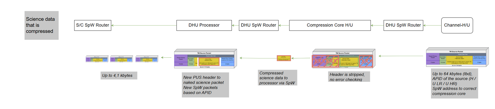
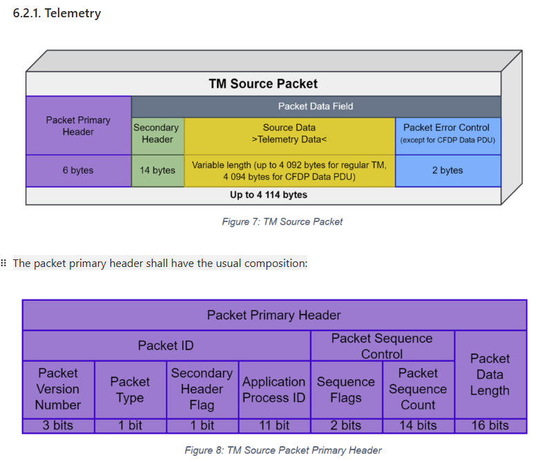

DOC: ESA-ENVIS-ESOC-GS-IF-003_ESA-EnVision_GenericFrameAndPacketStructure

question:

It is necessary to clarify how to manage the buffered sensor data or compressed data coming from different channels, because once compressed, the data is no longer in CCSDS packet format. In other words, how should we distinguish data from different VenS after compression?

For example, how should the memory in the buffer be retrieved and then transmitted to the processor?

需要明确的是：怎么管理来自不同通道buffered sensor data或者compressed data, 因为compressed data 不再是CCSDS packet了，也就是不同VenS 数据在压缩后怎么区分?比如进入buffer 的memory应该如何再被提取出来传输给 processor, 这涉及到需要processor 的软件部分来提取储存在buffer memory的数据

# packet sequence control: sequence (segmentation) Flags

The sequence flags shall be set as follows:

01bin means first packet of a group of packets

00bin means continuation packets

10bin means last packet of a group of packets

11bin means “stand-alone” packet

# Venspec format

**   ReqID**: 2.1.1.2

Since VenSpec-H only transmits complete lines of spectral channels, whileVenSpec-U provides full flexibility, only the band-interleaved per pixel (BIP)scheme shall be used, i.e. a spectral channels x special lines array of detector readout is used.

VenSpec-H outputs lines that contain all the spectral channels. This design naturally chunk-transmits an entire line of spectra at once

# ECSS‐E‐ST‐50‐53C

conjunction with the SpaceWire Standard, to provide a comprehensive set of services for onboard user application

The aim of the CCSDS Packet Transder Protocol is to transfer CCSDS Packets across a SpaceWire packet, transferring it across the SpW network and then extracting the CCSDS Packet at the target

# CCU-channels SWICD

## 3.1. Data flow

when science data transmit from SpW router to Compression core, Header is stripped, no error checking

## 6.1 SpaceWire

he maximum frequency is 100 MHz, but lower frequencies are also possible. Not all channels need to communicate with the same frequency. But all channels shall have symmetric communication, meaning both directions of the communication shall be done with the same frequency (TBC).

👀️# note that in our 4Links SpW Router, the spw and router use identical clock frequence(whether need to updated?)

## 6.2 CCSDS all packet (both science and telemetry) are CCSDS packets with PUS-C

### telemetry

Each data set will be split in Packets of 4084 bytes, with the last packet being potentially shorter

Compression can be configured for 2D(frames) or 3D(cubes = several frames)

### 6.2.3. Packet sizes

There are different types of data, that will be transmitted between CCU and channels. The different types and the maximum packet sizes are listed in the table

Science data Venspec-H (to be  compressed) incl. calibration, same to Venspec-U

* 64 KiByte supported  (transmission time will then be  \~1ms)
* Recommendation is to keep  length under 16Ki (tbc) for one  packet for best performance  (“continuous” operation of  compression core).

this packet size mensioned refers to the maximum supported size for science data packets sent from VenSpec-U to the CCU's compression cores. This is an internal communication within the VenSpec suite.

11.3

==The compression cores will have to be configured before a channel starts generating data. The header of the science packets to be compressed have to have a fixed length because the FPGA will strip that header irrespective of the content.==

scientific data to be compressed and ancillary data(e.g. telemetry data, HK, command copy, protocol bytes) shall not be transmitted within the same packet

==The compression cores will have to be configured before a channel starts generating data. The header of the science packets to be compressed have to have a fixed length because the FPGA will strip that header irrespective of the content.==

👀️@note what we need to determine is the size of the scientific data packet header

#### from pablo:

The problem is that the table breaks down in several requirements, which is why intended to present them as a table rather than a collection of requirements but here they are:

1. All packets related to the transmission of one data set (i.e. one frame or one cube) shall be transmitted by the channel as fully CCSDS-compliant packets with their own science APID and through service 213 TBC. This means, in particular, that they shall have the primary and secondary headers properly filled, as well as the trailing error detection field (2 bytes).
2. The data set metadata shall always be transmitted as TM(213,1) (TBC) to the SpW address of the processor. The first 4 bytes of the data in this packet shall be the data set ID, so that it can be correlated with the pixel information during reconstruction.
3. The data set data (the pixel values) shall be transmitted as one TM(213,2), zero or more TM(213,3) and zero or one TM(213,4). For each of these packets, the first 4 bytes of the data shall be the dat set ID, followed by 4 bytes of packet counter and then the pixel information. (see table for reference).
4. Science data packets that shall be transmitted to ground uncompressed shall be sent to the SpW address of the processor.
5. Science data packets to be compressed shall be transmitted to the assigned compression core SpW address.

## mail from Bj 20.05

This is very interesting and we should definitely discuss this further!
Of course there needs to be an additional parameter defining if 3D or 1D
compression to be used (for data <16bit).
But Benjamin from V-U proposes to use 3D compression only for Observation,
which is done with reduced dataset (205x74 or 205x18 pixels). The large
dataset for dark (and also for sun??) calibration could be compressed by 1D
only?
This said could mean, that also for V-H, 1D compression of the calibration
data could be sufficient??
This would result in only 1D compression for V-H and for V-U only a 3D
compression for max. 205x74 pixels, which could be handled without external
memory? Please check.
Of course, this would ease the dataflow to/from the memory and FPGA
internal structures significantly.

：因为目前我们没办法直接使用综合工具查看压缩核将使用的资源，因此我建立了一个Excel计算3d compression core将使用的FPGA RAM资源，这里分别计算了V-U LR and HR 两个参数下将使用的RAM 数量，结果分别是30 LSRAM and 11 LSRAM，这只是通过计算的大概范围，并且我们需要留意RTG4 的RAM比Smartfusion2 更小，（RTG4为209 LSRAM， SM2为 236），但对于V-U 如果只需要使用3d 压缩observation data 我们就可以不使用External memory 缓存临时数据而只使用BIP-mode

## mail from Bj 21.05

I think we need a complete overview of needed FPGA resources for the
different options (1D/3D compression for calibration and/or observation
data), including everything, so also including SpW cores, router, memory
controller, bus controller, I/O,...), like you started already:
[https://git.rz.tu-bs.de/ida/rosy/research/venspec/documentation/-/blob/main/Open\_Topics/FPGA%20resource%20usage/FPGA\_resource\_report.md?ref\_type=heads](https://git.rz.tu-bs.de/ida/rosy/research/venspec/documentation/-/blob/main/Open_Topics/FPGA%20resource%20usage/FPGA_resource_report.md?ref_type=heads)

Still one question is if there is no possibility to bypass the CCSDS-123
predictor and directly use the 121 compression, like in the attached image
(compression\_dataflow)? Or could we treat it as a super-long frame for 1D
compression with dimensions (1, y, z), as proposed by Pablo?

Concerning if 1D compression for calibration data is sufficient at all
(brought up by Benjamin from V-U), definitely more assessments needs to be
done. In the assessment done so far (compression\_ratios), only simulated
observation data was used and also there the difference between 121 and 123
was not very high. In any case, the required ratio of 1.4 is met. So, for
the time being, I would still stick to my proposal sent on Monday, not
using BIP-MEM at all.

reply:

是的，关于FPGA resource utilization 部分我将逐步完善

对于第二点，如compression\_dataflow 所展示的情况我们可以做到，只是我们需要在原有的IP core上进行修改，这相当于3D compression 和1D compression 使用同一个block encoder(也就是CCSDS121 block encoder), 所以我们需要在SHyLoC Top-level 部分 自己设计这一部分，并且需要修改CCSDS121 IP,  使得CCSDS121 在综合时就可以生成既符合1D压缩的结构，又符合3D压缩的结构，并且压缩数据流能能根据parameter 调整block encoder从哪一个predictor接收数据。

如果使用1D 压缩，super-long frame 我不明白的是这么做出于什么意义，对于1D 压缩 CCSDS121 使用Rice adaptive coding方式进行压缩，主要影响压缩率的是 数据之间的相关性，这表现在CCSDS121 所规定的J 块内样本中的相似性，这个J size 最大为64，所以当压缩V-U calibration data时，比如dark calibration, Nz 为2048 或者 sun calibration Nz 为190, 如果这都超过了每次CCSDS121 压缩J 个样本的大小，所以我不知道将2 instance 合成 一个 super-long frame 的意义是什么？

此外，我注意到在SWICD 中 x, y 所定义的方向依然没有改变。能否和Pablo确认这一点，

**Regarding your second point: as shown in the compression\_dataflow, we can indeed share a single block encoder (the CCSDS 121 block encoder) for both 3D and 1D compression. To do this, we must modify the existing IP core and add a top-level wrapper in SHyLoC. That wrapper will:** **• Configure the CCSDS 121 IP at synthesis time so it can implement either the 1D or 3D compression data path**
• Parameterize the data stream so the block encoder can dynamically select its predictor source **As for using a “super-long frame” in 1D compression, I’m not clear on its benefit. CCSDS 121 applies Rice adaptive coding over blocks of up to J=64 samples, and compression efficiency relies on sample correlation within each block. For V-U calibration data—e.g. Nz=2048 (dark) or Nz=190 (sun)—we already exceed the maximum block size, so splitting across two encoder instances (or merging into a super-long frame) wouldn’t improve correlation within each 64-sample block. Could you explain what advantage you envision?** **Finally, I noticed that the x- and y-axis definitions remain unchanged in the SWICD. Could you please check with Pablo to confirm thats?
