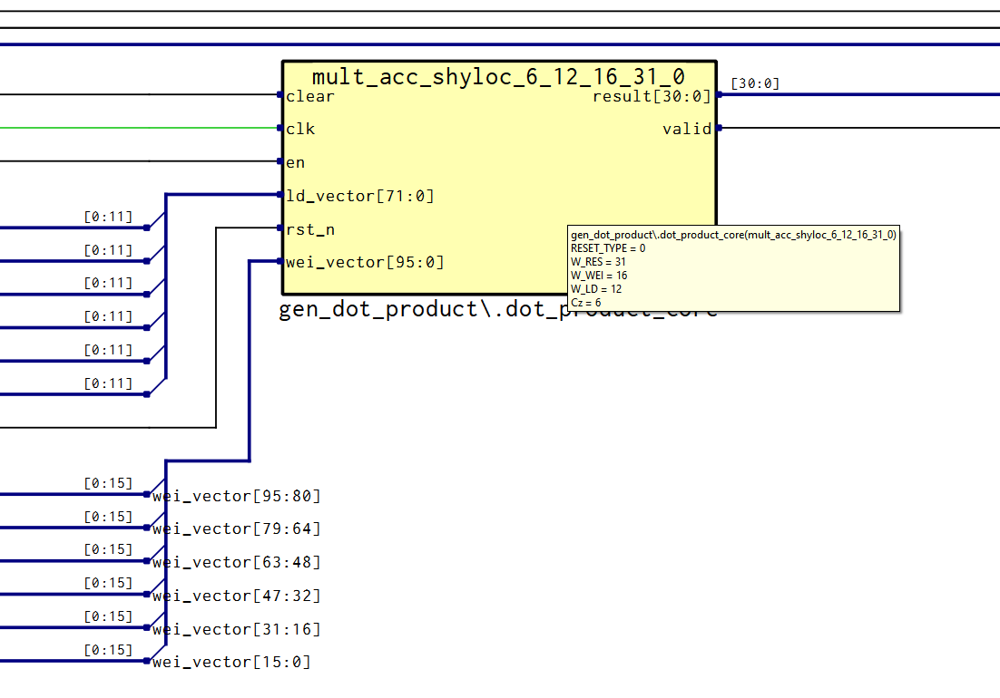
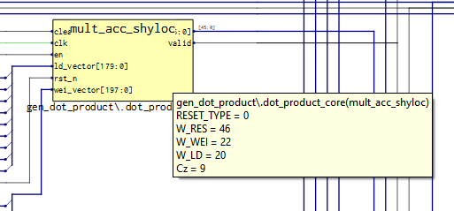

# Issue for instantiate 3 SHyLoC

After synthesizing 3 SHyLoCs, it was found that each SHyLoC uses 43 DSPs, compared to previous synthesis where only 7 DSPs were used.

来源：

in ccsds_comp_shyloc_bip_mem or bip is same

related to Cz

in ccsds123_constants:

--! Cz = P\_MAX if reduced prediction; Cz = 3 + P\_MAX when full prediction is used.

* P > 3 does not yield a significant improvement in the compression ration.

constant Cz: integer := FULL\*3 + P\_MAX;

~~~

~~~

in ccsds123_parameter

constant PREDICTION_GEN: integer := 0;        --! Full (0) or reduced (1) prediction.

so there are 3+6 = 9， 并且每个mult 使用4个 Math module

在system_shyloc 中的参数如上所示
--! Bit width of the local sum signed values.
constant W_LS: integer := D_GEN + 3;
--! Bit width of the localdiff signed values.
constant W_LD: integer := D_GEN + 4;
--! Bit width of the signed weights .
constant W_WEI: integer := OMEGA_GEN + 3;

## OMEGA_GEN [4:19] weight component resolution

origin design omega is setted to 19 , which is the max value, newer are set to 6

* after adjustment, each multiplier uses two MACCs

## SM2 RTG4 MACC blocks

MACC multiply-Accumulate, refers to dedicated hardware blocks designed specifically for multiply-accumulate operations, which are fundamental computational units used in digital processing(DSP) applications

18x18 bit multiplier

# BIP ordering store

under BIP ordering it is only necessary to store a local difference vector with Cz elements, since after prediction of a sample $S_{z}(t)$ only a single element of the local difference vector needs to be updated for the prediction of  $S_{z+1}(t)$, the next sample in BIP order. Of course this implies that $N_z$ weight vectors are stored; one of each band.

In terms of data dependencies, it is not necessary to complete prediction of a sample $S_{z}(t)$ before starting prediction of the next sample $S_{z+1}(t)$ in BIP order, thus making possible to schedule the  prediction of sample $S_{z+1}(t)$in parallel with the weight  update operation of sample $S_{z}(t)$. This is a clear advantage of  BIP ordering which makes it a key feature to achieve very  high data-rate performance

# DHU 数据 buffer memory是否足够的问题
